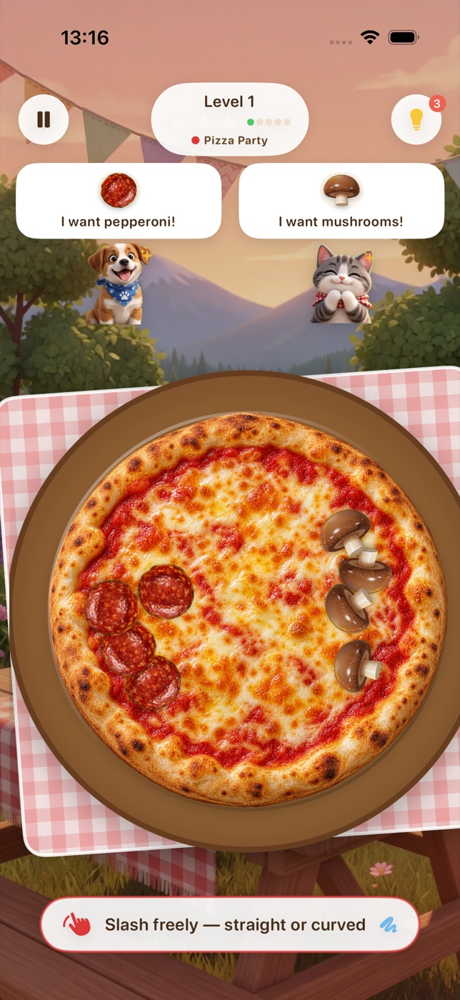
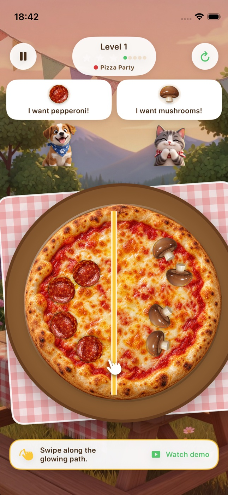
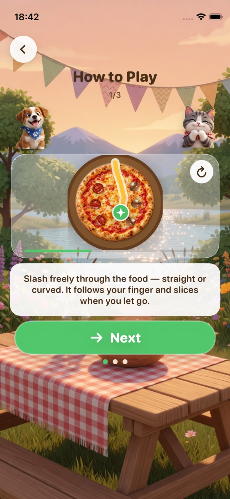
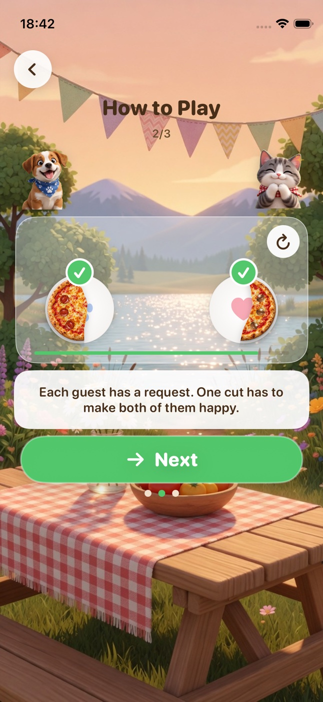
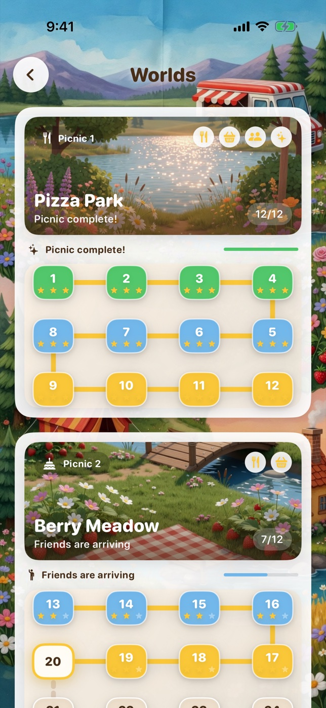

# Split Picnic

**One slice. Two happy guests.** An offline iPhone and iPad puzzle about making two picnic guests happy with one freehand cut. Swipe straight or curve around toppings; the pizza or berry pie separates along the path you drew.

<p align="center">
  
  
  
</p>
<p align="center">
  
  
  
</p>

[](#app-target)
[](#build-and-run)
[](#build-and-run)
[](LICENSE)

[Guide](docs/GUIDE.md) · [App Store information](docs/APP-STORE.md) · [Privacy](PRIVACY.md)

## Play

A round is one cut:

1. On first launch, watch two short looping tutorials: a curved finger swipe, then the two slices travelling to their guests. Replay them later in Settings → How to Play.
2. Read both orders. Early levels introduce the ingredients; later ones add exact counts and forbidden toppings.
3. Swipe freely across the dish with your finger. A colorful trail follows every bend in the gesture.
4. Lift your finger and the halves immediately slide apart — no ruler or confirmation button.
5. The left piece goes to the left guest, and the right piece to the right guest. Match the orders to win.

There is no physics engine and no hidden event to reconstruct. Geometry classifies every topping, then the two plates move.

Later worlds add a fairness rule: both slices must stay close in area. Some levels require a clean cut that does not touch any topping; the live swipe trail turns red when the path is not clean. The hint bulb animates a viable path for the current puzzle, can replay without spending another hint, and links back to the tutorials without losing the level. Hints affect the star rating. A narrow crust edge, cheese strands, crumbs, haptics, and seven synthesized sound cues give the cut some weight.

## Worlds

1. **Pizza Park** — learn the cut with pepperoni, mushrooms, olives, pineapple, onion, corn, mozzarella, and more.
2. **Berry Meadow** — count berries and avoid forbidden fruit.
3. **Forest Picnic** — satisfy two detailed orders.
4. **Sunset Bakery** — balance portions while keeping the cut clean.

Twelve levels in each world, 48 in total, with twelve distinct ingredients across the picnic. Every world is its own picnic: its winding map fills with stars and changes from preparation to a table set, friends arriving, and a celebration in full swing. Tablecloth themes cycle every three levels through unlocked patterns, with the collection choice setting the start of the cycle. The last four challenges in every world combine tighter corridors, exact counts, forbidden toppings, clean paths, and fair portions. Several honest cuts can work; the catalog stores one hint swipe so a level is never impossible. Pip, Miso, Sunny, Ginger, Clover, and Rascal form mixed animated pairs that change from picnic to picnic.

## More to explore

The world maps change as stars accumulate. Picnic guests rotate between puppies, kittens, a bunny, and a raccoon; tablecloths change every few levels. There is a daily puzzle and a collection of unlocked themes and plates. Everything runs locally without an account, ads, tracking, or network access.

## App target

- iPhone and iPad (universal)
- iOS 18+
- Portrait on iPhone; portrait and landscape on iPad
- No account, no tracking, no network

Bundle ID: `com.sergiiziborov.splitpicnic`

## Build and run

Open the checked-in `SplitPicnic.xcodeproj` in Xcode, select an iPhone or iPad simulator, and Run. The project targets iOS 18+ and Swift 6. No external package or account is needed for simulator builds.

```bash
xcodebuild -project SplitPicnic.xcodeproj -scheme SplitPicnic \
  -destination 'generic/platform=iOS Simulator' CODE_SIGNING_ALLOWED=NO build
```

If you edit `project.yml`, install [XcodeGen](https://github.com/yonaskolb/XcodeGen) and run `./scripts/generate-project.sh`. For simulator tests and a signed install on your own device, follow the [guide](docs/GUIDE.md). Tests cover authored solutions, freehand geometry, and the main UI flows.

## Project layout

```
SplitPicnic/
  App/              # scene, navigation, play session
  Game/Engine/      # cut geometry, orders, catalog, layout
  Game/Food/        # pizza, pie, toppings, cut effects
  Game/Guests/      # six animated guests with rotating picnic casts
  Features/         # home, tutorial, play, result, worlds, daily, collection
  Persistence/      # local stars and settings
  DesignSystem/     # picnic palette, buttons, copy
```

The evaluator is independent of SwiftUI so a cut can be tested without a scene.

## License

Source-available under the [Split Picnic Source License](LICENSE). This project is **not MIT-licensed**. Commercial use, redistribution, and competing derivatives need prior written permission.

© 2026 Sergii Ziborov.
