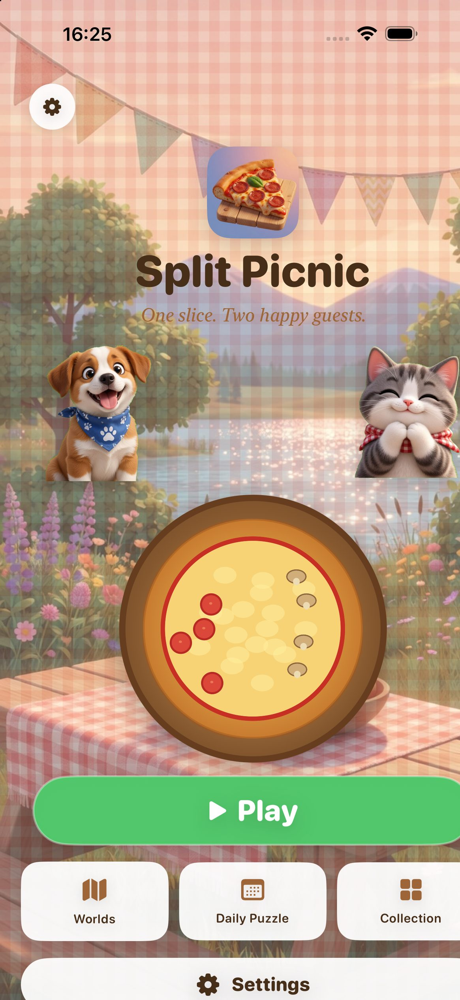

# Split Picnic

**One slice. Two happy guests.**

Draw a single straight line through a pizza or a berry pie. The two pieces slide to Pip the puppy and Miso the kitten. If the toppings match their orders, they cheer. If not, the plates explain the miss without a lecture.

<p align="center">
  
</p>

[](#app-target)
[](#build-and-run)
[](#build-and-run)
[](LICENSE)

## Play

A round is one cut:

1. Read both orders. Early levels give one guest a real request and the other the rest.
2. Drag a straight line across the dish. Handles stay so you can nudge it.
3. Tap **Slice!** The halves slide apart.
4. Pip sits on the left of the table. Miso sits on the right. The piece whose centre is further left is Pip’s.

There is no physics engine and no hidden event to reconstruct. Geometry classifies every topping, then the two plates move.

Later worlds add a second guest order, then a fairness rule: both slices must stay close in area. Those constraints are not mixed into the first picnic.

## Worlds

1. **Pizza Park** — pepperoni, mushrooms, olives. Learn the cut.
2. **Berry Meadow** — two strawberries, no cherries.
3. **Forest Picnic** — both guests have a real order.
4. **Sunset Bakery** — fair slices, still one line.

Eight levels in each world. Several honest cuts can work; the catalog stores one hint line so a level is never impossible.

## Why this loop

The whole idea fits on one screen. The finger action is the result. A miss is two faces and two plates, not a tip card. The line can be adjusted before you confirm, so the puzzle is not a fingertip exam.

## App target

- iPhone and iPad (universal)
- iOS 18+
- Portrait on iPhone; portrait and landscape on iPad
- No account, no tracking, no network

Bundle ID: `com.sergiiziborov.splitpicnic`

## Build and run

```bash
brew install xcodegen   # if needed
cd split-picnic
xcodegen generate
open SplitPicnic.xcodeproj
```

Select an iPhone or iPad simulator, then Run.

```bash
xcodebuild test \
  -scheme SplitPicnic \
  -destination 'platform=iOS Simulator,name=iPhone 16'
```

Unit tests prove every authored hint cut actually feeds both guests, and that a clearly wrong cut on the opening pizza fails.

## Project layout

```
SplitPicnic/
  App/              # scene, navigation, play session
  Game/Engine/      # cut geometry, orders, catalog, layout
  Game/Food/        # pizza, pie, toppings, split clip
  Game/Guests/      # Pip and Miso
  Features/         # home, play, result, worlds, daily, collection
  Persistence/      # local stars and settings
  DesignSystem/     # picnic palette, buttons, copy
```

The evaluator is independent of SwiftUI so a cut can be tested without a scene.

## License

Source-available under the [Split Picnic Source License](LICENSE). This project is **not MIT-licensed**. Commercial use, redistribution, and competing derivatives need prior written permission.

© 2026 Sergii Ziborov.
